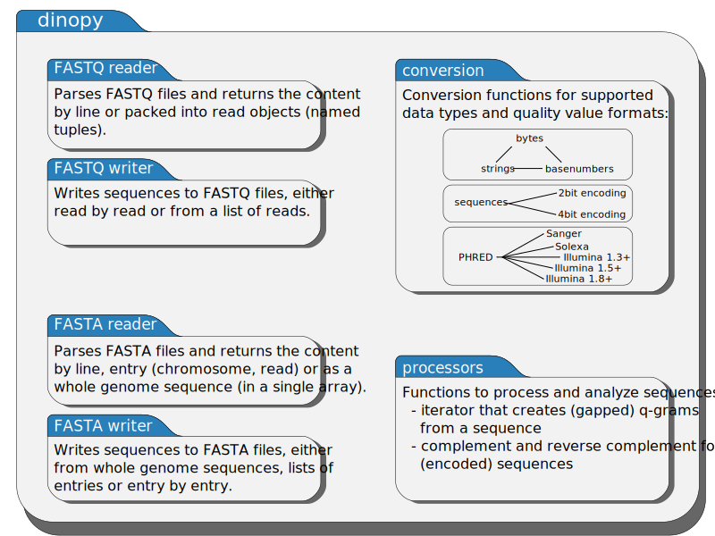

.. role:: py(code)
   :language: python
.. _introduction:

========================
 Introduction to dinopy
========================

.. contents::
    :local:
    :depth: 1

What is dinopy?
=====================
Dinopy is a Python/ Cython package targeted at scientists working with
biological sequences such as DNA.
Basically, it provides readers and writers for FASTA, FASTQ, and SAM files, which are implemented in Cython and also expose a Cython API.

Why use dinopy?
===============
When developing a Python application that works on biological sequences
file-io sooner or later becomes an issue.
For example a parser for FASTQ files is easily written, but it is an error prone task [1]_
that can slow down both the development process and the runtime of the application.
Dinopy aims to eliminate this time consuming factor by providing input and output
facilities for the most commonly used file formats in bioinformatics.
For additional speedup, dinopy has been implemented in Cython and 
Further, dinopy also exposes a Cython API to minimize the amount of required Python code in Cython projects.

.. [1] especially since the FASTQ 'specification' *does* allow linebreaks.

Many common tasks in bioinformatics involve iterating over big input files.
Some of those are too big to be kept in memory.
Often only subsequences of length q (*q-grams*) are needed to perform an analysis.
When working on huge files -- such as the human genome -- keeping the whole file
in memory is simply not an option if you do not happen to have lots of memory at
your disposal.
Dinopy provides several options to cope with this problem.

* Efficient datastructures
    Dinopy makes use of compact and efficient datastructures, such as numpy arrays,
    bit encoded sequences etc.

* Iterators
    Python iterators make writing online algorithms for processing lots of data very easy.
    In most cases, you do not need the complete data in memory, but only a rather small
    part of it that needs processing *right now*.

* Selection of chromosomes from FASTA files
    Often we are only interested in a specific chromosome from a FASTA file. 
    Dinopy can extract one or more chromosome sequences from a file.
    This can be sped up by providing an annotation file in .fai format.
    If such a file is not present, dinopy can create one to speed up further access.

* q-gram level functions
    dinopy can provide access to all qgrams in a reference genome or a set of reads
    in a few lines of code.::

        import dinopy
        fp = dinopy.FastaReader("ecoli.fasta")
        for qgram in dinopy.qgrams(fp.reads(), 5):
            print(qgram)

Some more examples can be found in the :ref:`examples` chapter.

What can dinopy do?
===================
Dinopy contains four major classes and some functions for everyday use,
such as computing the reverse complement of a dna sequence.

* FastaReader
    * Reads in FASTA files
    * Provides iterators for
        * All entries in the file
        * All lines in the file
        * All reads in the file
        * User-selected chromosomes in the file [2]_
    * Allows reading the complete genome (to memory)

* FastqReader
    * Reads in FASTQ files
    * Provides iterators for
        * All lines in the file
        * All reads in the file with or without quality values
    * Can tally up quality values for all reads and provides statistics 

* FastaWriter
    * Writes a FASTA file to disk
    * Sequence can be provided:
        * As a list of chromosomes
        * As a whole genome with an index for the chromosome borders

* FastqWriter
    * Writes a FASTQ file to disk
    * Sequence can be provided:
        * As a list of reads without quality values
        * As a list of :code:`(read, quality_values)` tuples

* Neat little everyday functions
    * complement and reverse-complement
    * q-gram creation from a sequence (both normal and shaped q-grams)
    * upcoming / work in progress
        * qgram-index
        * suffix-array

.. [2] i.e. supplies only those chromosomes which the user has selected, either by name or by index, e.g. "the first and the third chromosome" or "chromosomes with names 'chromosome_I' or 'chromosome_III'"

